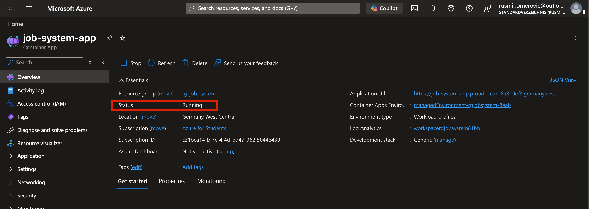
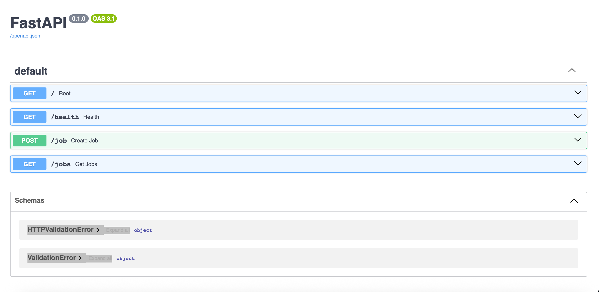
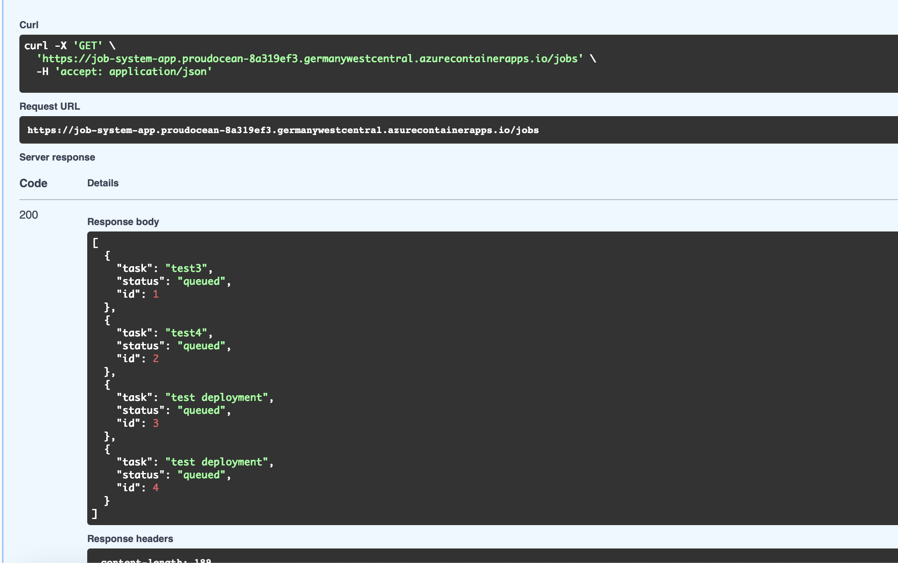
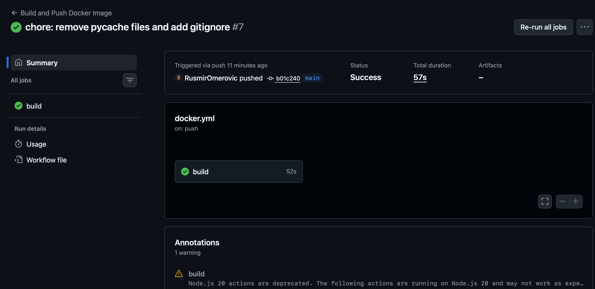

# Job System API

Cloud-native backend API built with FastAPI, PostgreSQL, Docker, GitHub Actions, Kubernetes and Azure Container Apps.

---

# Project Goal

This project was built to learn and demonstrate modern DevOps and backend engineering workflows:

* REST API development
* containerization with Docker
* multi-service orchestration
* CI/CD automation
* Kubernetes basics
* cloud deployment on Azure
* external PostgreSQL integration

The application allows creating and retrieving simple jobs via API endpoints.

---

# Live Deployment

```text
https://job-system-app.proudocean-8a319ef3.germanywestcentral.azurecontainerapps.io
```

Interactive API documentation:

```text
/docs
```

Healthcheck:

```text
/health
```

---

# Architecture

```text
Client
   ↓
FastAPI API
   ↓
Docker Container
   ↓
Azure Container Apps
   ↓
Neon PostgreSQL Database
```

CI/CD flow:

```text
Git Push
   ↓
GitHub Actions
   ↓
Docker Image Build
   ↓
Push to GHCR
   ↓
Manual Azure Redeploy
```

---

# Tech Stack

| Component           | Technology                       |
| ------------------- | -------------------------------- |
| Backend API         | FastAPI                          |
| Database            | PostgreSQL                       |
| ORM                 | SQLAlchemy                       |
| Containerization    | Docker                           |
| Local Orchestration | Docker Compose                   |
| CI/CD               | GitHub Actions                   |
| Container Registry  | GitHub Container Registry (GHCR) |
| Orchestration       | Kubernetes (kind)                |
| Cloud Runtime       | Azure Container Apps             |
| Cloud Database      | Neon PostgreSQL                  |

---

# API Endpoints

| Method | Endpoint  | Description          |
| ------ | --------- | -------------------- |
| GET    | `/`       | API root endpoint    |
| GET    | `/health` | Healthcheck endpoint |
| POST   | `/job`    | Create a new job     |
| GET    | `/jobs`   | Retrieve all jobs    |
| GET    | `/docs`   | Swagger/OpenAPI UI   |

---

# Project Structure

```text
job-system/
│
├── app/
│   ├── database.py
│   ├── main.py
│   ├── models.py
│   └── routes.py
│
├── .github/
│   └── workflows/
│
├── k8s/
│
├── docker-compose.yml
├── Dockerfile
├── requirements.txt
└── README.md
```

---

# Core Components Explained

## `database.py`

Defines:

* database connection
* SQLAlchemy engine
* session handling
* ORM base class

Purpose:

```text
Python ↔ PostgreSQL communication layer
```

---

## `models.py`

Defines database table structures as Python classes.

Example:

```python
class Job(Base):
```

Represents the `jobs` table in PostgreSQL.

---

## `routes.py`

Contains API business logic and endpoints.

Handles:

* creating jobs
* retrieving jobs
* database interaction

---

## `main.py`

Application entry point.

Responsible for:

* starting FastAPI
* registering routes
* creating database tables
* root and health endpoints

---

# Local Development

## Clone Repository

```bash
git clone <repo-url>
cd job-system
```

---

## Create Virtual Environment

```bash
python -m venv venv
source venv/bin/activate
```

---

## Install Dependencies

```bash
pip install -r requirements.txt
```

---

# Run Locally

## Docker Compose

```bash
docker compose up --build
```

Application:

```text
http://localhost:8000
```

Swagger UI:

```text
http://localhost:8000/docs
```

---

# Kubernetes

Local Kubernetes testing was done using:

```text
kind
```

Concepts practiced:

* Deployments
* Services
* Pods
* networking
* debugging
* container orchestration

---

# CI/CD

GitHub Actions automatically:

* builds Docker images
* validates workflows
* pushes images to GHCR

Current deployment flow:

```text
git push
→ GitHub Actions build
→ GHCR push
→ manual Azure redeploy
```

---

# Azure Deployment

The API is deployed publicly using:

```text
Azure Container Apps
```

Features used:

* public HTTPS endpoint
* environment variables
* container deployment
* cloud runtime
* log monitoring

---

# Database

The project uses:

```text
Neon PostgreSQL
```

Reason:

* external persistent storage
* cloud-native PostgreSQL
* separation between application and data layer

---

# Screenshots

## Azure Container App



---

## Swagger UI



---

## API Response



---

## GitHub Actions Workflow



---

# Key Learnings

This project helped build practical understanding of:

* backend APIs
* Docker workflows
* container networking
* CI/CD automation
* Kubernetes basics
* cloud deployment
* debugging distributed systems
* environment variables
* infrastructure thinking

---

# Future Improvements

Potential next steps:

* automatic Azure deployment (full CD)
* API authentication
* Kubernetes Secrets
* monitoring with Prometheus/Grafana
* Terraform infrastructure
* frontend dashboard

---

# Status

```text
Project Status: Completed MVP / Portfolio Ready
```
